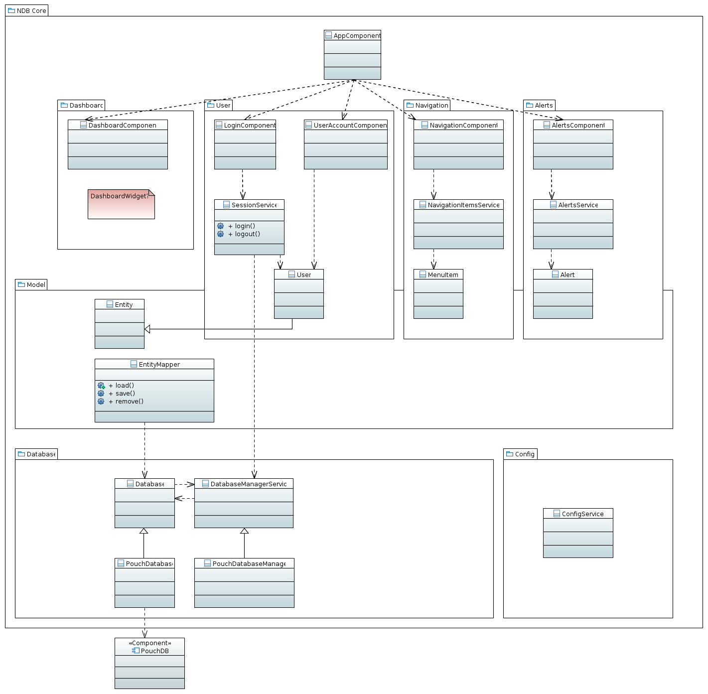

[](https://travis-ci.org/NGO-DB/ndb-core)

# NGO DB
Empowering NGOs' social workers with simple to use (database) software.

For a project outline, free demo system, etc. visit [ngo-db.sinnfragen.org](http://ngo-db.sinnfragen.org/)

**This is an Angular2/Typescript based rewrite of [HELGO DB](https://github.com/NGO-DB/helgo_db)**

**For an example how to build a concrete application on top of ndb-core, see the [ndb-sample repository](https://github.com/NGO-DB/ndb-sample)**


## Installation
The project depends on a couple of tools which are required for development. Please make sure you have the following installed:
- [npm (NodeJS)](https://www.npmjs.org/)
- [bower](http://bower.io)

You can simply clone this repository to get all the code with its configuration and requirements.
Install the dependencies with
```
npm install
```

You can then start npm's local development server to run the project with
```
npm start
```


## Architecture
This is a rough sketch of the architecture of the core system under discussion:


An actual, specific software system to be used will be based on the core and extend it:


## Working with the Database Services

Normally there should be no need to use `Database` (or even `DatabaseManagerService`) anywhere to load/save/remove data in the database.
This is done using the `EntityMapperService` (or a custom MapperService extending `EntityMapperService` for special entity types).

Example: load and save data in the database

    export class ExampleService {
    
        // get EntityMapperService through Dependency Injection
        constructor(private _entityMapper: EntityMapperService) {  }
    
        getExampleUser() {
            // load requires an instance of the Entity (sub)type as second argument
            this._entityMapper.load<User>("x-user", new User())
                .then(function(userEntity) {
                    // userEntity is an instance of class User containing the information from the database
                    console.info(userEntity);
                })
                .catch(function(error) {
                    if(error.status == 404) {
                        console.info("no record with this _id in database");
                    }
                });
        }
    }
