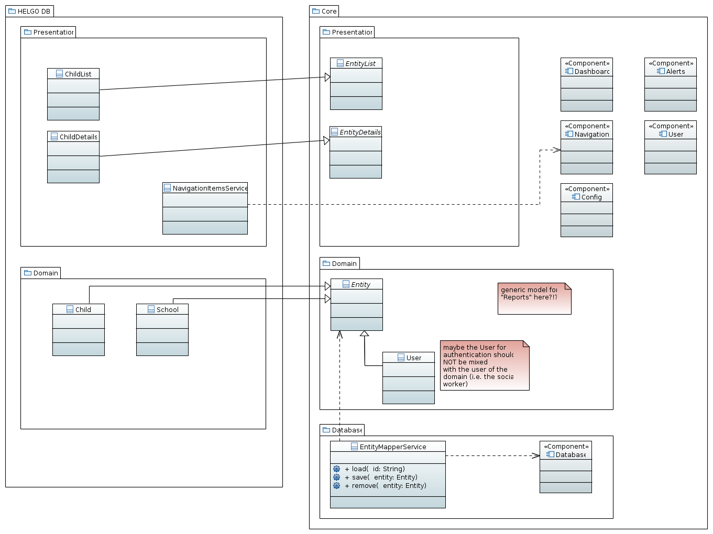

# NGO DB
Empowering NGOs' social workers with simple to use (database) software.

For a project outline, free demo system, etc. visit [ngo-db.sinnfragen.org](http://ngo-db.sinnfragen.org/)

> This is an Angular2/Typescript based rewrite of [HELGO DB](https://github.com/NGO-DB/helgo_db)

## Architecture
This is a rough sketch of the architecture of the core system under discussion:

An actual, specific software system to be used will be based on the core and extend it:

