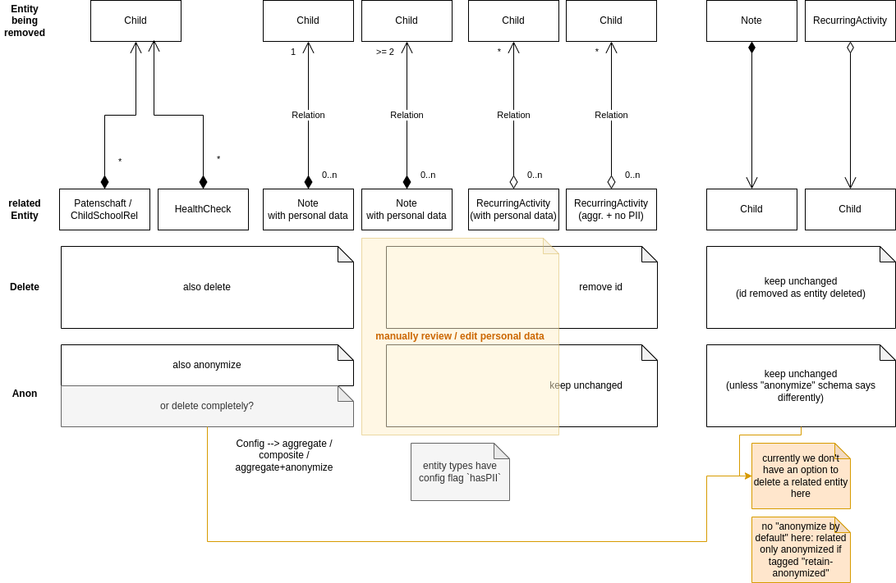

# Archive / Anonymize Entities
-----
Any entity can be archived (i.e. marked as inactive and hidden from UI by default) or anonymized (i.e. discarding most data and keeping a few selected properties for statistical reports).
This is often preferable to deleting a record completely. Deleting data also affects statistical reports, even for previous time periods.
By anonymizing records, all personal identifiable data can be removed and the remaining stub record can be stored indefinitely, as it is not subject to data protection regulations like GDPR anymore.

Anonymization is configured as part of the entity schema.
Data of fields that are not explicitly marked to be retained during anonymization is always deleted (anonymization by default).

To keep some data even after the user "anonymized" a record, configure the `anonymize` property of the `@DatabaseField` decorator:
- `anonymize: "retain"` will keep this field unchanged and prevent it from being deleted
- `anonymize: "retain-anonymized"` will trigger a special "partial" deletion that depends on the dataType (e.g. date types will be changed to 1st July of the given year, thereby largely removing details but keeping data to calculate a rough age)

## Cascading anonymization / deletion
Relationships between entities are automatically handled when the user anonymizes or deletes an entity.
Any related entities that reference the anonymized/deleted entity are checked 
and - depending on their configured role - may be updated or anonymized as well.

The logic follows the scenarios shown below:

## Data Protection & GDPR regarding anonymization / pseudonomyzation
The "anonymize" function is implemented specifically for data protection rules requiring to delete personal data.
According to the EU's "General Data Protection Regulation" (GDPR) "anonymous" data does not fall under its regulations:

- GDPR is not applicable to anonymous data: "The principles of data protection should therefore not apply to [...] personal data rendered anonymous in such a manner that the data subject is not or no longer identifiable." [GDPR Recital 26](https://gdpr-info.eu/recitals/no-26/)
  - "To determine whether a natural person is identifiable, account should be taken of all the means reasonably likely to be used, such as singling out, either by the controller or by another person to identify the natural person directly or indirectly."
  - "To ascertain whether means are reasonably likely to be used to identify the natural person, account should be taken of all objective factors, such as the costs of and the amount of time required for identification, taking into consideration the available technology at the time of the processing and technological developments."
- "Pseudonymisation enables the personal data to become unidentifiable unless more information is available whereas anonymization allows the processing of personal data to irreversibly prevent re-identification." [source](https://www.privacycompany.eu/blogpost-en/what-are-the-differences-between-anonymisation-and-pseudonymisation)
- _also see this [good overview of anonymization misunderstandings and considerations](https://edps.europa.eu/system/files/2021-04/21-04-27_aepd-edps_anonymisation_en_5.pdf)_

In the case of records being retained "anonymized" in Aam Digital, we provide a context that makes re-identification even harder:
- only authorized users of the system can access even the anonymized record (where only a few properties have been retained). Unless the organisation actively shares the data, it remains as securely protected as the personal data managed in Aam Digital.
- those authorized users with access to the anonymized records (and therefor a theoretical chance to attempt re-identification) are team members of an organization. They have been screened to be responsible persons and are usually legally bound to keep information confidential.
- by default only a few, explicitly selected properties in anonymized records are retained (data minimization by default). As such, both re-identification likelihood and the impact in case of re-identification are reduced as far as possible.

--> If our anonymization process is configured thoughfully on a case by case basis to only retain a few data fields that are not easy indirect identifiers, it seems reasonably unlikely that the person can be identified after the anonymization process. Therefore, GDPR should not apply to these records and it is legitimate to retain these for statistical reporting.
