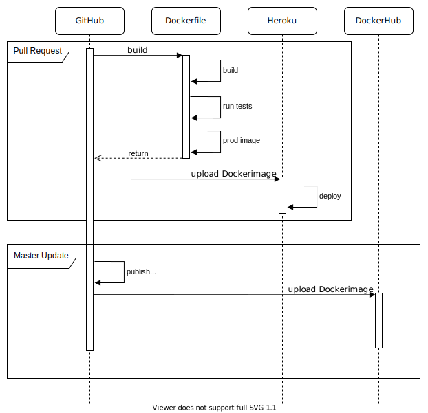

# Infrastructure

Aam Digital is an Angular application and can be deployed on a simple webserver.
To do so we are using Docker and some other tools.

The following diagram show the actions that are performed when new code changes are published.

## Dockerfile

The Dockerfile can be found in [/build/Dockerfile](https://github.com/Aam-Digital/ndb-core/blob/master/build/Dockerfile).
It provides a stable environment where the application is build, tested and packaged.
It consists of two stages.
The first stage is build on top of a `node` image and builds the application for production usage and optionally runs tests and uploads the test coverage.
The second stage is build on top of a `nginx` image and only copies the files from the previous stage, which are necessary for deploying the application.
This process makes the final image as small as possible.
`nginx` is used to run a lightweight webserver.
The configuration for `nginx` can be found in [/build/default.conf](https://github.com/Aam-Digital/ndb-core/blob/master/build/default.conf).

## Pull Requests

Whenever a new pull request is created, GitHub creates a new app on Heroku and posts the link to this app in the PR.
For each new commit of a PR, GitHub then builds the Docker image for this branch.
This includes building the application in production mode, linting the sourcecode and running the tests.
If all these stages pass, GitHub will upload the newly created image to Heroku.
Once this is done, a version of Aam Digital with the new changes included can be visited through the posted link.

## Master Updates

After approving a PR and merging it into the master, semantic release automatically creates a new tag for this change.
For each new tag a tagged Docker image is uploaded to [DockerHub](https://hub.docker.com/r/aamdigital/ndb-server).

## Deploying Aam Digital

The Docker image from DockerHub can then be downloaded and run via Docker using the following command:

> docker pull aamdigital/ndb-server && docker run -p=80:80 aamdigital/ndb-server

However, this will only run Aam Digital in demo-mode.
To run Aam Digital with a real database, a new `config.json` file has to be mounted into the image.
This should have a structure equal to `config.default.json` ([/src/assets/config.default.json](https://github.com/Aam-Digital/ndb-core/blob/master/src/assets/config.default.json)).
It holds the information about where to find the remote database, what the name of the app is and in which mode the app is being run.

The [ndb-setup](https://github.com/Aam-Digital/ndb-setup) project provides a clear workflow for how to deploy a new instance of Aam Digital and CouchDB.
It extends the Docker image with a `docker-compose.yml` file which handles all the dependencies.
For further information checkout the [README](https://github.com/Aam-Digital/ndb-setup/blob/master/README.md).
