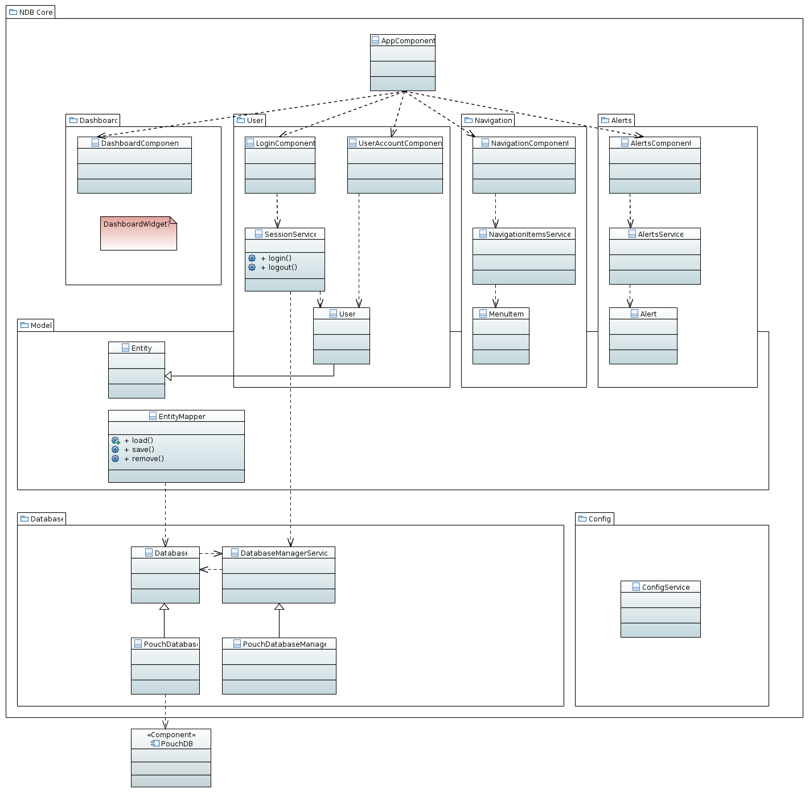
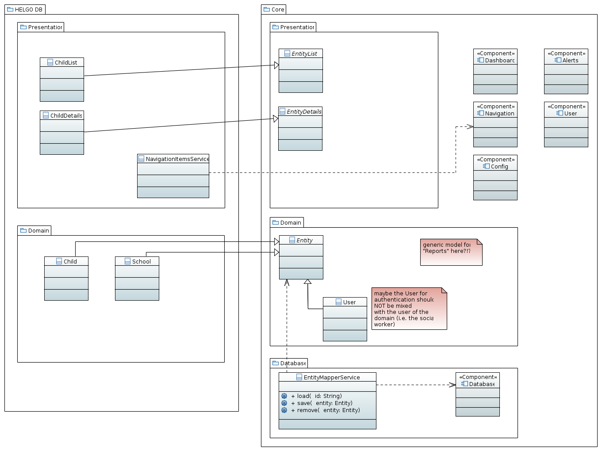

# Overall Structure

This is a rough sketch of the architecture of the core system under discussion. The modules and classes shown here are included in the ndb-core repository.

An actual, specific software system to be used will be based on the core and extend it:

## Folder Structure

The application code is split within the `src/app/` directory into modules providing
general features and abstract components (_core_) and
concrete feature modules for users' use cases (currently only _child-dev-project_).
