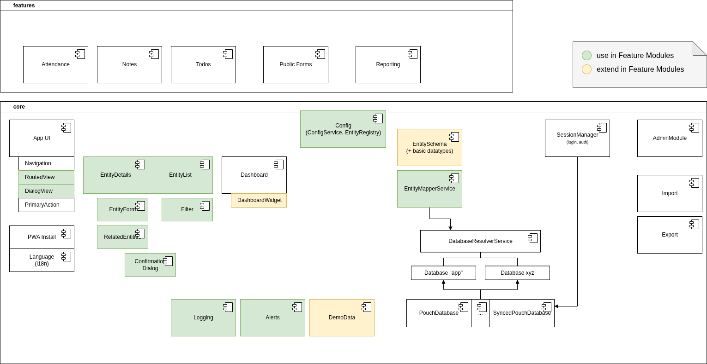

# Overall Structure

This is a rough sketch of the architecture of the core system under discussion.
The modules and classes shown here are included in the ndb-core repository.
Note that some components and services are explicitly designed to be used and extended when developing feature modules,
while others will usually not need to be touched or understood when extending the system:

## Folder Structure

The application code is split within the `src/app/` directory into modules providing
general features and abstract components (_core_) and
concrete feature modules for users' use cases (currently only _child-dev-project_).

Overall the following guidelines apply:

- Different functionalities are usually split into separate Angular Modules each in its own folder.
- At least all core features are well documented with JsDoc comments
  and therefore also have a complete API Reference here (see [Modules](/modules.html)).
- If you have a certain challenge, browse the "How-To Guides" here in the documentation —
  reusable features and approaches are documented there.
