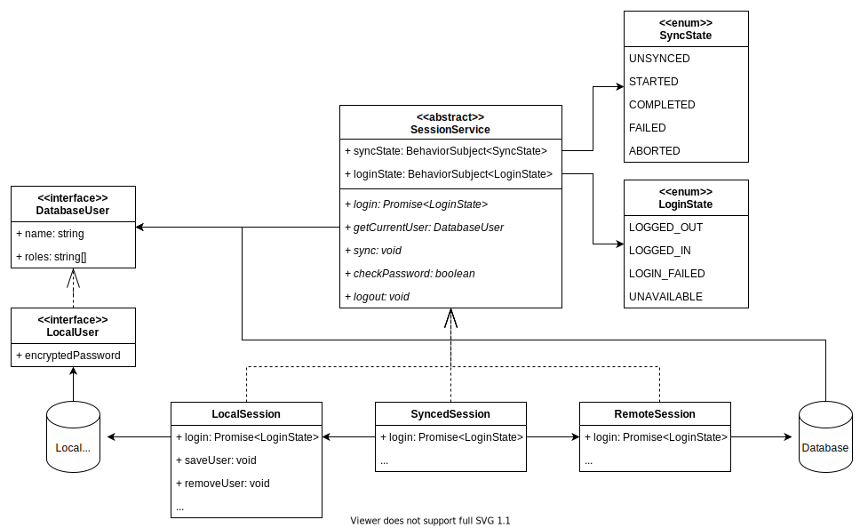
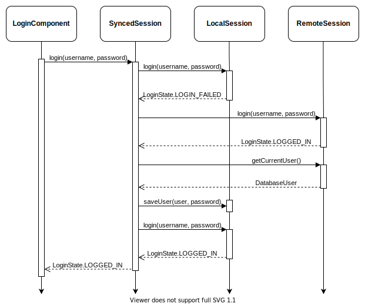

# Session Handling, Authentication & Synchronisation

This document aims at describing the architecture of the offline-first session handling, focussing on the `(Synced)SessionService`.

<!-- TOC -->

- [Components](#components)
- [State](#state)
- [Database User](#database-user)
  - [Local User](#local-user)
- [Session Services](#session-services)
  - [Local Session](#local-session)
  - [Remote Session](#remote-session)
  - [Synced Session](#synced-session)

<!-- /TOC -->

## Components

The following diagram show which components are involved in managing the session.

.

There are three implementations of the `SessionService` interface: [LocalSession](#local-session), [RemoteSession](#remote-session) and the [SyncedSession](#synced-session).
They are described in more detail in the [SessionServices](#session-services) section.

## State

Lets talk about state for a second. With an offline-first synced session, there is lots of state involved needing to be synced. The following enums are used to define the possible states.

- **LoginState** At the beginning or after logout the state is `LOGGED_OUT`. After successful login, the state changes to `LOGGED_IN`. Entering wrong credentials will result in `LOGIN_FAILED`. If login is not possible at the moment (due to bad or no internet) the state is `UNAVAILABLE`.
- **SyncState** At the beginning or without internet the state is `UNSYNCED`. Once the user logs in the state changes to `STARTED`. If no problems occur, the state will change to `COMPLETED`, once all data is synced. If an error occurs the state changes to `FAILED`.

## Database User

The `DatabaseUser` interface mirrors parts of the user documents as it is used by CouchDB (see [here](https://docs.couchdb.org/en/stable/intro/security.html?highlight=_users#users-documents)).
The most important properties are the `name` which is equivalent to the username and the `roles` which is an array of roles the user has.
The `name` can be used to assign e.g. notes to a user or find the `User` entity in the database.
The roles are used to check whether the user has permissions to visit certain pages or edit certain entities.

### Local User

The `LocalUser` interface is used by the [LocalSession](#local-session) to store user information in the local storage.
Additionally to the fields of the `DatabaseUser` interface it holds the encrypted password together with information how the password is encrypted.
This can be used to verify the password later on.

## Session Services

The `SessionService` interface provides methods for `login`, `logout` and user access.
These methods need to be implemented to create a working session.

### Local Session

The `LocalSession` manages a session without internet. It can be used for demo purposes or when no network connection is available.
The session loads `LocalUser` objects from the local storage and uses the encrypted password to validate login credentials.
It provides an additional method to save `DatabaseUser` objects together with the password to the local storage.
If the password matches, it returns `LoginState.LOGGED_IN`.
If the username matches an existing username but the password is wrong, it returns `LoginState.LOGIN_FAILED`.
If the username does not match any saved users, it returns `LoginState.UNAVAILABLE`.

### Remote Session

The `RemoteSession` directly authenticates against a CouchDB instance.
It uses the [\_session](https://docs.couchdb.org/en/stable/api/server/authn.html?highlight=session#cookie-authentication) endpoint of the CouchDB API for cookie-authentication.
Once successfully logged in, a cookie is stored and sent with any further request to CouchDB.
This cookie is valid for 10 minutes and renewed by CouchDB if regular requests occur.
If the password matches, it returns `LoginState.LOGGED_IN`.
If CouchDB returns are `401` error (unauthorized), it returns `LoginState.LOGIN_FAILED`.
If the requests fails with an error message other thatn `401`, it returns `LoginState.UNAVAILABLE`.

### Synced Session

The `SyncedSession` combines the `LocalSession` and the `RemoteSession`.
It starts the login workflow of both the `RemoteSession` and the `LocalSession` at the same time.
It first only waits for the `LocalSession` because this is faster and also works without internet.
Only if the local login fails the `SyncedSession` waits for the remote login.
If the remote login succeeds, the returned user object is saved through the `LocalSession` to allow a local login next time.

The following table shows all possible return values of the local and the remote session and the handling of the synced session.
The error message is shown in the `LoginComponent`

| Remote Login | Local Login  | Synced Login    | Error Message                                |
| ------------ | ------------ | --------------- | -------------------------------------------- |
| LOGGED_IN    | LOGGED_IN    | login + sync    | -                                            |
| LOGGED_IN    | LOGIN_FAILED | sync + login    | -                                            |
| LOGGED_IN    | UNAVAILABLE  | sync + login    | -                                            |
| LOGIN_FAILED | LOGGED_IN    | login -> logout | -                                            |
| LOGIN_FAILED | LOGIN_FAILED | LOGIN_FAILED    | Username and/or password incorrect           |
| LOGIN_FAILED | UNAVAILABLE  | LOGIN_FAILED    | Username and/or password incorrect           |
| UNAVAILABLE  | LOGGED_IN    | login + retry   | -                                            |
| UNAVAILABLE  | LOGIN_FAILED | LOGIN_FAILED    | Username and/or password incorrect           |
| UNAVAILABLE  | UNAVAILABLE  | UNAVAILABLE     | Please connect to the internet and try again |

To illustrate this table, the following flow-diagram shows what happens in the case `RemoteLogin: LOGGED_IN` and `LocalLogin: LoginFailed`.
This case happens when the password of a user has been changed on the server, but not locally and the users logs in with the new password.

.

The flow starts by the user entering a username and a password in the `LoginComponent`.
First the user credentials are validated against the local session.
This fails possible because the saved password does not match the user-entered one.
Then the synced session waits for the remote login to finish.
In this case the remote login succeeds and the `DatabaseUser` object can be retrieved from the remote session.
The synced session then stores the `DatabaseUser` in the local session and after that tries to log in against the local session.
Now that the `DatabaseUser` has been saved with the new password the local log in succeeds and returns `LoginState.LOGGED_IN`.
