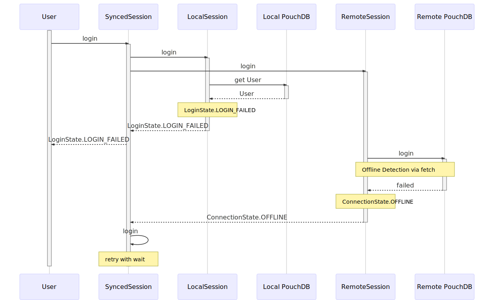
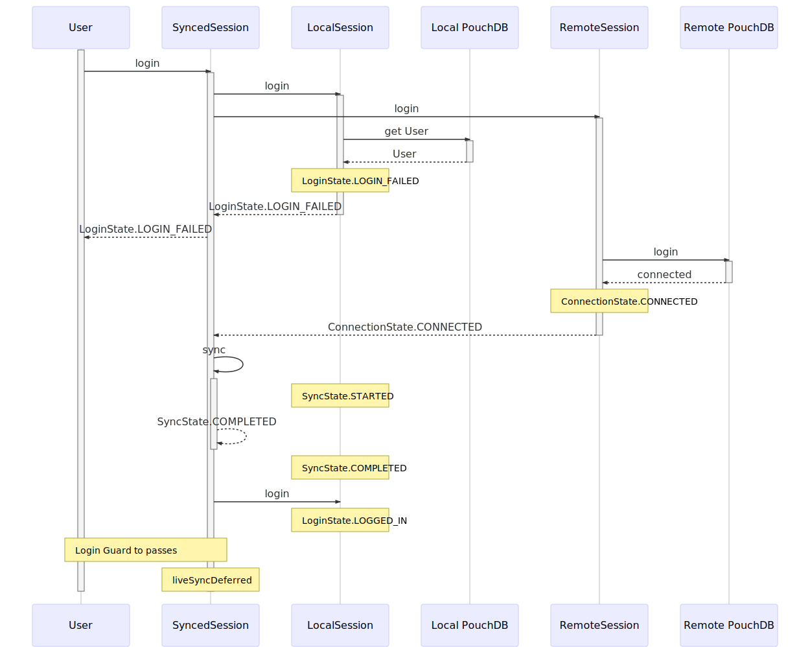
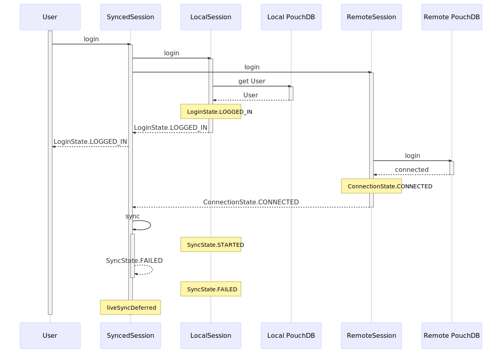
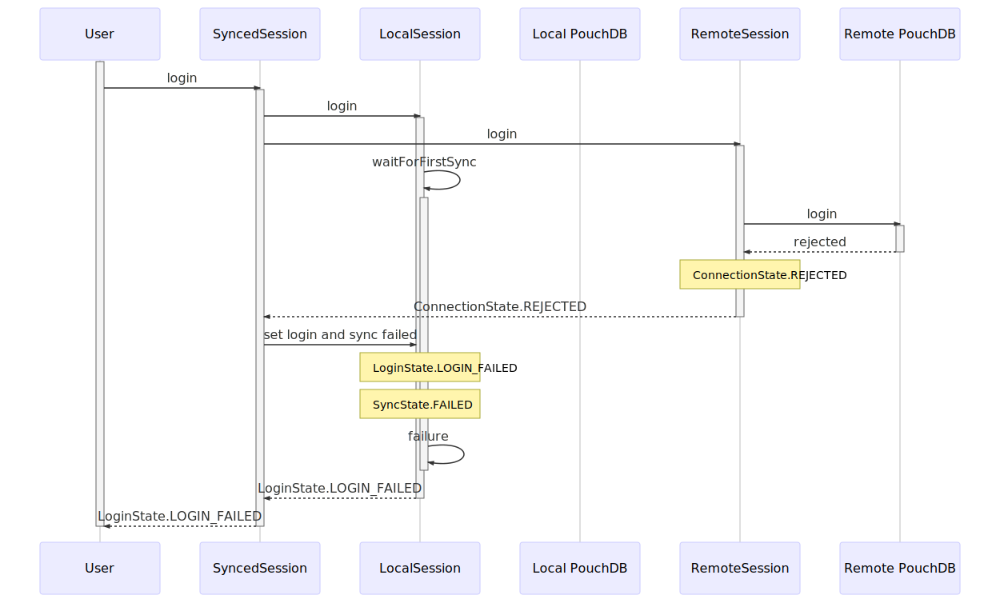

# Session Handling, Authentication & Synchronisation

This document aims at describing the architecture of the offline-first session handling, focussing on the `(Synced)SessionService`.

<!-- TOC -->

- [State](#state)
- [Login Flow](#login-flow)
- [Class Diagrams](#class-diagrams)
- [Sequence Diagrams for Login](#sequence-diagrams-for-login)
    - [Usual Flows](#usual-flows)
        - [Correct Password](#correct-password)
        - [Wrong Password](#wrong-password)
    - [Offline Flows](#offline-flows)
        - [Correct Password](#correct-password-1)
        - [Wrong Password](#wrong-password-1)
    - [Password Changed](#password-changed)
        - [Use old password](#use-old-password)
        - [Use new password](#use-new-password)
    - [Sync Failed Flows](#sync-failed-flows)
        - [Local Login succeeded](#local-login-succeeded)
        - [Local Login failed](#local-login-failed)
    - [Initial Sync Flows](#initial-sync-flows)
        - [Online with correct password](#online-with-correct-password)
        - [Online with wrong password](#online-with-wrong-password)
        - [Offline](#offline)
        - [Other sync failures](#other-sync-failures)

<!-- /TOC -->

There are some modules involved in Session Handling:

- **Database**: Contains an abstraction over database with a common interface, the implementation of that interface for PouchDB (`PouchDatabase`), and another implementation providing mock data (`MockDatabase`).
- **Entity**: Contains an EntityMapper to be used with the database abstraction. Other modules may choose to implement the abstract class `Entity` and add annotations of the `EntitySchemaService` in order to be saved in the database.
- **User**: Users are one such entity, providing additional methods to check its hashed password stored in the database.
- **Session**: Contains the services holding everything together: `SessionService` provides an abstract class specifying the interface of an actual implementation (its not an interface, as interfaces will be optimized by the TypeScript compiler and can't be used for injection - which is necessary in our case.) There are also two such implementations: `MockSessionService` implements a local session backed by a `MockDatabase` to be used during development and unit tests, `SyncedSessionService` the production version with sync backed by `PouchDatabase`.

## State

Lets talk about state for a second. With an offline-first synced session, there is lots of state involved needing to be synced. The following diagrams provide an overview on state and transitions:

- **LoginState**: Central state of the application: Is the user logged in or not? One can go directly from `loginFailed` to `loggedIn` by just entering the correct credentials at the UI after a failed attempt.
- **ConnectionState**: ConnectionState describes the connection to the remote database. `disconnected` describes that no connection shall be established, i.e. before login and after logout. The remote database may reject a login (i.e. due to wrong credentials), causing state `rejected`. Additionally, the connection state may switch between `offline` and `connected`, when the user's browser goes offline or online after connection was established at least once.
- **SyncState**: SyncState describes the state of database synchronization. Initially, that state is `unsynced`. The synchronization started after a successful connection to the remote database may change that state.

LoginState depends primarily on the local database, as a login must be possible in case the user is offline. ConnectionState depends only on the remote database. While SyncState is conceptually somewhere _between_ the two, it is also associated with the local database, as the local login depends on the synchronization, when there is no database available (i.e. when the application is first started in a fresh browser).

## Login Flow

_Note: Please refer to the code in the `SyncedSessionService` for details - there are lots of comments to make clear, what is happening when. Feel free to also take a look at the sequence-diagrams below that capture the flow in various scenarios_

- Login is attempted at both the local and the remote database in parallel. The result of the local login is returned as promise.
- The local login will wait for the first initial synchronization of the local database in case it was empty, so users are available for offline login.
- The login at the remote database will return the ConnectionState as a promise. The following situations are possible:
    1. The user may be `offline`. In this case, the remote login will be queued for retry at a later point in time. If the local login went through, this won't affect the user's ability to work with the application. If the local database is empty (and the local login is therefor waiting for a first login), the SyncedSessionService will set the SyncState to `failed` so the local login won't be pending forever, but can be aborted by the local session.
    2. The remote database may connect successfully (state `connected`), in which case the SyncedSessionService will start a synchronization. If the local database was empty, the local login waits until this synchronization is finished. After a successful sync, a liveSync will be queued for starting at the next tick (not immediately, as listeners to the EventChangedStream may not be notified due to the way browsers handle promise execution in Microtasks).
    3. When the remote database rejects connection (state `rejected`), but the local login was successful, we have inconsistent authentication due to changed passwords. In this case, the login will be failed by the SyncedSessionService. Keep in mind that the user has been able to work with his old password until the rejection from the remote database is present.

## Class Diagrams

The local session depends on the user entity being loaded from the database. Doing this the standard way with the EntityMapperService would result in a circular dependency, which is why that specific part of code must be duplicated in the LocalSession.

The following diagram shows most classes and services in the session. The `MockSessionService` and the abstract base class `SessionService`, as well as the `EntitySchemaService` used in the `LocalSession` to construct the the `User` are omitted for layout-reasons. The `databaseProvider` is created by the Session module and depends on the `SyncedSessionService` (or `MockSessionService`, depending on app configuration)-

## Sequence Diagrams for Login

### Usual Flows
Local database is present, remote password was not changed.

#### Correct Password

#### Wrong Password

### Offline Flows
Local Database is present, but we are offline

#### Correct Password

#### Wrong Password

We must retry with wait here, as we might be in a situation where the remote password changed and we should actually be able to log in. See these flows for details.

### Password Changed
Local Database is present, but we changed the password and password state is inconsistent between local and remote.

#### Use old password
Works locally but not on the remote.

#### Use new password
Works on the remote but not locally.

### Sync Failed Flows
So the remote session connected, but for some reason other than being offline the sync fails. I don't know how, but this might happen.

#### Local Login succeeded
Easiest case. Just start the liveSync and hope everything works out eventually. There should be some sync-indicator listening to the sync state to make the user aware that something is going wrong in the background.

#### Local Login failed
This is most probably a changed password case. However, as the sync failed, we cannot log the user in locally, so we have to keep the login failed. We also don't start a liveSync here, as it confuses the hell out of the UI to be not logged in but have a running (and intermittently failing) liveSync here. We might want to revisit this behavior, though.

### Initial Sync Flows
The local database is initial. We must wait for a first sync before we can log anyone in.

#### Online with correct password

#### Online with wrong password

#### Offline
We can't have the local login pending for too long. We also don't want the login explicitly failed (resulting in wrong password messages), so we just switch back to logged off.

#### Other sync failures
We don't know what to do in this case. We can't have the local login pending forever. We also don't want the login explicitly failed (resulting in wrong password messages), so we just switch back to logged off.

