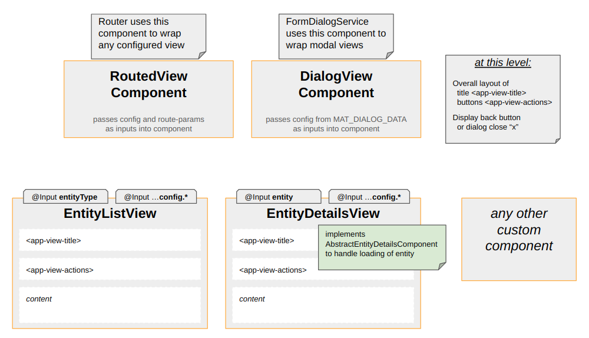

# How to create a custom View Component

We aim to build flexible, reusable components.
If you implement a custom component using the building blocks of Aam Digital's platform, this can seamlessly be displayed both in modal forms and as a fullscreen view.

## Architecture & Generic wrapper components

The following architecture allows you to implement components that only have `@Input` properties
and do not access either Route or Dialog data directly.
Instead, the platform always uses `RoutedViewComponent` or `DialogViewComponent` to parse such context and pass it into your component as simple Angular @Inputs.



If you implement a special view to display a single entities' details, you should also extend `AbstractEntityDetailsComponent` with your component.
This takes care of loading the entity from the database, in case it is passed in as an id from the URL.

## Implementing a custom view Component

1. Create a new component class
2. Add any `@Input()` properties for values that are provided from the config.
3. For EntityDetails views, you get access to an `@Input() entity` and `@Input() entityConstructor` via the `AbstractEntityDetailsComponent` automatically. Otherwise, you do not have to extend from this.
4. Use `<app-view-title>` and `<app-view-actions>` in your template to wrap the elements (if any) that you want to display as a header and action buttons.
   These parts are automatically placed differently in the layout depending on whether your component is display as a fullscreen, routed view (actions displayed top right) or as a dialog/modal (actions displayed fixed at bottom).
5. Register your component under a name (string) with the `ComponentRegistry` (usually we do this in one of the modules), so that it can be referenced under this string form the config.
6. You can then use it in config, as shown below.

Example template for a custom view component:

```html
<app-view-title>
  <!-- the title is specially fixed and receives a back button or dialog close -->
  My Entity {{ entity.name }}
</app-view-title>

<!-- anything in the template not specially marked/wrapped is used as main content -->
<div>My Custom View Content</div>

<app-view-actions>
  <!-- some action buttons, e.g. using the app-dialog-buttons or anything else -->
  <app-dialog-buttons [form]="form" [entity]="entity"></app-dialog-buttons>
</app-view-actions>
```

An example config for the above:

```json
{
  "component": "MyView",
  "config": { "showDescription": true }
}
```

Use the `ComponentRegistry` to register your component,
e.g. in its Module:

```javascript
export class MyModule {
  constructor(components: ComponentRegistry) {
    components.addAll([
      [
        "MyView", // this is the name to use in the config document
        () => import("./my-view/my-view.component").then((c) => c.MyViewComponent),
      ],
    ]);
  }
}
```
