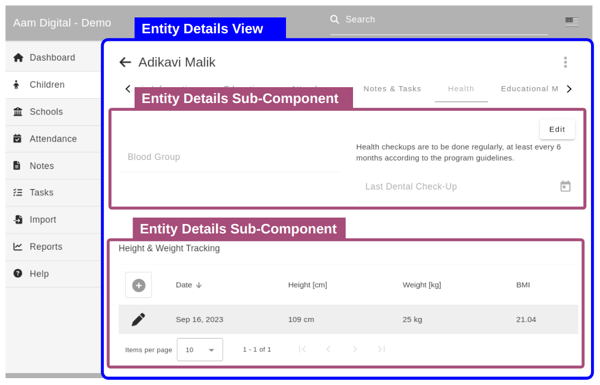

# How to create an Entity Details Panel
Aam Digital as a platform takes care of loading the relevant entity and configs for an "Entity Details View",
which displays the information about a single entity (e.g. one specific student).
The `EntityDetailsComponent` handles this initialization from the route.
To display some details in a customized way, you can create "sub-components" that receive a reference to the current entity and their config parameters as `@Input()` automatically.


The tabs (in the config called "panels") within the Entity Details view can display one or more "sub-components", as shown above.

To make these components as re-usable and simple as possible, we do not load config from the route here.
Instead, the components are intialized from config by the `DynamicComponentDirective`.
This automatically sets `@Input()` properties to the value with the same name in the config object.

Those background details aside, what that means for your implementation is:

## Implementing a new Sub-Component

1. Create a new component class
2. Add an `@Input() entity: Entity;`. This will always contain the entity object, whose Details View is currently being displayed. You should not load this yourself from the database.
3. (If needed) Add more inputs for aspects that should be configurable about your component.
(e.g. `@Input() showDescription: boolean;`, which you can use in your template or code to adapt the component.)
These values are automatically set to whatever value is specified in the config object for your component at runtime in the database.
4. Register the new component in its parent module, so that it can be loaded under its name through the config.

An example config for the above:
```json
{
  "component": "MySubView",
  "config": { "showDescription": true } 
}
```

### Registering the new Sub-Component for use in config
Use the `ComponentRegistry` to register your component,
e.g. in its Module:
```javascript
export class MyModule {
  constructor(components: ComponentRegistry) {
    components.addAll([
      [
        "MySubView", // this is the name to use in the config document 
        () => import("./my-sub-view/my-sub-view.component").then((c) => c.MySubViewComponent),
      ],
    ]);
  }
}
```
