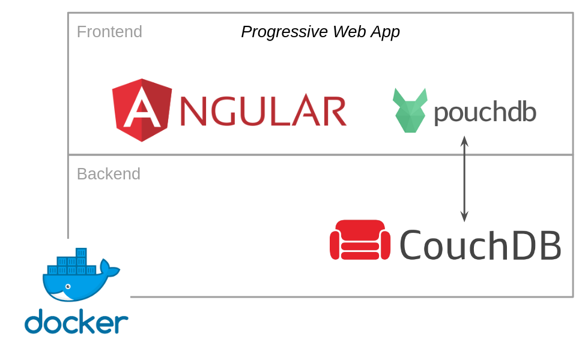

# Tutorial: An Overview of our Technologies and Framework

Aam Digital is based on the following technologies:
- [Angular](https://angular.io/),
including the [TypeScript](https://www.typescriptlang.org/) programming language (a superset of JavaScript)
as well as HTML and CSS
- [Angular Material](https://material.angular.io/) providing reusable UI components
- PouchDB (CouchDB noSQL Database)

In addition, we use Docker and nginx to deploy and run the application.

If you are not familiar with (some of) our tools and technologies yet,
here are some useful resources to get started.
You will need to have basic knowledge of these before you can properly start contributing to our project.

## Git (and GitHub)
Git helps us track all changes to our project, allows us to revert things and is the basis for our code review process.

Haven't worked with _git_ source control yet?
Work through a basic tutorial like this
[Intro to Git and GitHub for Beginners (Tutorial)](https://product.hubspot.com/blog/git-and-github-tutorial-for-beginners). 

You can also check out the [official git book](https://git-scm.com/book/de/v2) (chapter 1-3 are most relevant).

## TypeScript
TypeScript is our primary programming language.
If you are familiar with JavaScript, learning TypeScript shouldn't be too hard for you.
All JavaScript code is also valid TypeScript.
TypeScript just adds some things on top to make development easier and less error-prone.

_(If you don't know JavaScript yet, you can find an endless amount of online courses to learn it - go and do some of these before continuing here!)_

If you have some experience with another "statically typed" language like Java, the additional concepts of TypeScript should feel familiar.
A quick comparison like this may be enough to get you a basic understanding: [TypeScript vs. JavaScript](https://medium.com/geekculture/typescript-vs-javascript-e5af7ab5a331)

## Angular
Angular is a powerful web development framework and the basis for our project.
It provides good structure to build complex enterprise-level web applications
with its concepts of components, services and modules.

It does take a while to work through Angular's core concepts.
But every minute you invest into understanding these basics now will make your development easier and cleaner forever after.

Follow the introductory material and tutorial: [Angular - Getting started](https://angular.io/start)

You will need a solid understanding of the Angular basics of components, services, dependency injection.
The more advanced topics beyond that are things you can also learn while already working on our project.
We'll be happy to guide you!

## Angular Material
We are using some standard UI components following the Material Design as building blocks.

Browse through the list of components to get an idea what is already available
(so that we don't reinvent the wheel):
https://material.angular.io/components/categories

## PouchDB
We have built an abstraction layer of the database access.
Underneath our app is using PouchDB but you do not need any knowledge about this for most work on our project.

Curious or want to work on our database services?
Start here: https://pouchdb.com/learn.html

-----
Next up:
 [**> Setting up the project (and running it)**](./setting-up-the-project.html)

