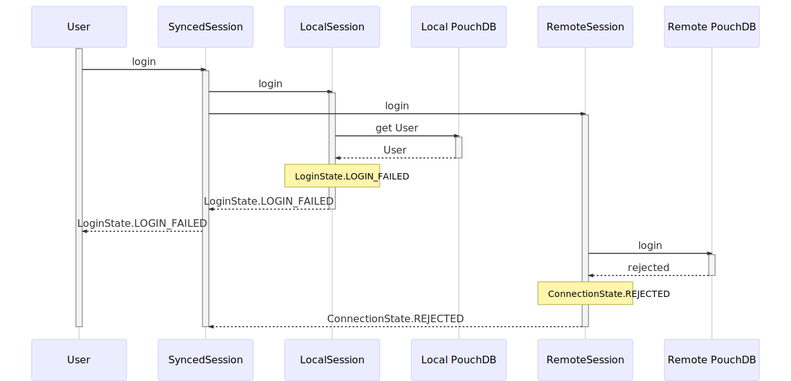

# Sequence Diagrams for Session Handling

## Usual Flows
Local database is present, we are online, remote password was not changed.

### Correct Password


### Wrong Password




## Offline Flows
Local Database is present, but we are offline

### Correct Password


### Wrong Password


We must retry with wait here, as we might be in a situation where the remote password changed and we should actually be able to log in. See these flows for details.


## Password Changed
Local Database is present, but we changed the password and password state is inconsistent between local and remote.

### Use old password
Works locally but not on the remote.


### Use new password
Works on the remote but not locally.


## Sync Failed Flows
So the remote session connected (yay!), but for some reason other than being offline the sync fails. I don't know how, but this might happen.

### Local Login succeeded
Easiest case. Just start the liveSync and hope everything works out eventually. There should be some sync-indicator listening to the sync state to make the user aware that something is going wrong in the background.


### Local Login failed
This is most probably a changed password case. However, as the sync failed, we cannot log the user in locally, so we have to keep the login failed. We also don't start a liveSync here, as it confuses the hell out of the UI to be not logged in but have a running (and intermittently failing) liveSync here. We might want to revisit this behavior, though.


## Initial Sync Flows
The local database is initial. We must wait for a first sync before we can log anyone in.

### Online with correct password


### Online with wrong password


### Offline
We can't have the local login pending for too long. We also don't want the login explicitly failed (resulting in wrong password messages), so we just switch back to logged off.


### Some other terrible sync failure
We don't know what to do in this case. We can't have the local login pending forever. We also don't want the login explicitly failed (resulting in wrong password messages), so we just switch back to logged off.


# Mermaid Source

All diagrams are done with Mermaid - markdown preview integration is available for vscode.

## Usual Flows
Local database is present, remote password was not changed.

### Correct Password

```mermaid
sequenceDiagram
    participant User
    participant SyncedSession
    participant LocalSession
    participant Local PouchDB
    participant RemoteSession
    participant Remote PouchDB

    activate User
    User->>+SyncedSession: login
    SyncedSession->>+LocalSession: login
    SyncedSession->>+RemoteSession: login

    LocalSession->>+Local PouchDB: get User
    Local PouchDB-->>-LocalSession: User
    Note over LocalSession: LoginState.LOGGED_IN
    LocalSession-->>-SyncedSession: LoginState.LOGGED_IN
    SyncedSession-->>User: LoginState.LOGGED_IN

    RemoteSession->>+Remote PouchDB: login
    Remote PouchDB-->>-RemoteSession: connected
    Note over RemoteSession: ConnectionState.CONNECTED
    RemoteSession-->>-SyncedSession: ConnectionState.CONNECTED

    SyncedSession->>+SyncedSession: sync
    Note over LocalSession: SyncState.STARTED
    SyncedSession-->>-SyncedSession: SyncState.COMPLETED
    Note over LocalSession: SyncState.COMPLETED
    Note over SyncedSession: liveSyncDeferred
    deactivate Session
    deactivate User
```

### Wrong Password

```mermaid
sequenceDiagram
    participant User
    participant SyncedSession
    participant LocalSession
    participant Local PouchDB
    participant RemoteSession
    participant Remote PouchDB

    activate User
    User->>+SyncedSession: login
    SyncedSession->>+LocalSession: login
    SyncedSession->>+RemoteSession: login

    LocalSession->>+Local PouchDB: get User
    Local PouchDB-->>-LocalSession: User
    Note over LocalSession: LoginState.LOGIN_FAILED
    LocalSession-->>-SyncedSession: LoginState.LOGIN_FAILED
    SyncedSession-->>User: LoginState.LOGIN_FAILED

    RemoteSession->>+Remote PouchDB: login
    Remote PouchDB-->>-RemoteSession: rejected
    Note over RemoteSession: ConnectionState.REJECTED
    RemoteSession-->>-SyncedSession: ConnectionState.REJECTED

    deactivate Session
    deactivate User
```

## Offline Flows
Local Database is present, but we are offline

### Correct Password

```mermaid
sequenceDiagram
    participant User
    participant SyncedSession
    participant LocalSession
    participant Local PouchDB
    participant RemoteSession
    participant Remote PouchDB

    activate User
    User->>+SyncedSession: login
    SyncedSession->>+LocalSession: login
    SyncedSession->>+RemoteSession: login

    LocalSession->>+Local PouchDB: get User
    Local PouchDB-->>-LocalSession: User
    Note over LocalSession: LoginState.LOGGED_IN
    LocalSession-->>-SyncedSession: LoginState.LOGGED_IN
    SyncedSession-->>User: LoginState.LOGGED_IN

    RemoteSession->>+Remote PouchDB: login
    Note over RemoteSession,Remote PouchDB: Offline Detection via fetch
    Remote PouchDB-->>-RemoteSession: failed
    Note over RemoteSession: ConnectionState.OFFLINE
    RemoteSession-->>-SyncedSession: ConnectionState.OFFLINE

    SyncedSession->>SyncedSession: login
    Note over SyncedSession: retry with wait
    deactivate Session
    deactivate User
```

### Wrong Password

```mermaid
sequenceDiagram
    participant User
    participant SyncedSession
    participant LocalSession
    participant Local PouchDB
    participant RemoteSession
    participant Remote PouchDB

    activate User
    User->>+SyncedSession: login
    SyncedSession->>+LocalSession: login
    SyncedSession->>+RemoteSession: login

    LocalSession->>+Local PouchDB: get User
    Local PouchDB-->>-LocalSession: User
    Note over LocalSession: LoginState.LOGIN_FAILED
    LocalSession-->>-SyncedSession: LoginState.LOGIN_FAILED
    SyncedSession-->>User: LoginState.LOGIN_FAILED

    RemoteSession->>+Remote PouchDB: login
    Note over RemoteSession,Remote PouchDB: Offline Detection via fetch
    Remote PouchDB-->>-RemoteSession: failed
    Note over RemoteSession: ConnectionState.OFFLINE
    RemoteSession-->>-SyncedSession: ConnectionState.OFFLINE

    SyncedSession->>SyncedSession: login
    Note over SyncedSession: retry with wait
    deactivate Session
    deactivate User
```

We must retry with wait here, as we might be in a situation where the remote password changed and we should actually be able to log in. See these flows for details.

## Password Changed
Local Database is present, but we changed the password and password state is inconsistent between local and remote.

### Use old password
Works locally but not on the remote.

```mermaid
sequenceDiagram
    participant User
    participant SyncedSession
    participant LocalSession
    participant Local PouchDB
    participant RemoteSession
    participant Remote PouchDB

    activate User
    User->>+SyncedSession: login
    SyncedSession->>+LocalSession: login
    SyncedSession->>+RemoteSession: login

    LocalSession->>+Local PouchDB: get User
    Local PouchDB-->>-LocalSession: User
    Note over LocalSession: LoginState.LOGGED_IN
    LocalSession-->>-SyncedSession: LoginState.LOGGED_IN
    SyncedSession-->>User: LoginState.LOGGED_IN

    RemoteSession->>+Remote PouchDB: login
    Remote PouchDB-->>-RemoteSession: rejected
    Note over RemoteSession: ConnectionState.REJECTED
    RemoteSession-->>-SyncedSession: ConnectionState.REJECTED

    SyncedSession->>LocalSession: logout + fail
    Note over LocalSession: LoginState.LOGIN_FAILED
    Note over User,SyncedSession: Login Guard rejects

    deactivate Session
    deactivate User
```

### Use new password
Works on the remote but not locally.

```mermaid
sequenceDiagram
    participant User
    participant SyncedSession
    participant LocalSession
    participant Local PouchDB
    participant RemoteSession
    participant Remote PouchDB

    activate User
    User->>+SyncedSession: login
    SyncedSession->>+LocalSession: login
    SyncedSession->>+RemoteSession: login

    LocalSession->>+Local PouchDB: get User
    Local PouchDB-->>-LocalSession: User
    Note over LocalSession: LoginState.LOGIN_FAILED
    LocalSession-->>-SyncedSession: LoginState.LOGIN_FAILED
    SyncedSession-->>User: LoginState.LOGIN_FAILED

    RemoteSession->>+Remote PouchDB: login
    Remote PouchDB-->>-RemoteSession: connected
    Note over RemoteSession: ConnectionState.CONNECTED
    RemoteSession-->>-SyncedSession: ConnectionState.CONNECTED

    SyncedSession->>+SyncedSession: sync
    Note over LocalSession: SyncState.STARTED
    SyncedSession-->>-SyncedSession: SyncState.COMPLETED
    Note over LocalSession: SyncState.COMPLETED
    SyncedSession->>LocalSession: login
    Note over LocalSession: LoginState.LOGGED_IN
    Note over User,SyncedSession: Login Guard to passes
    Note over SyncedSession: liveSyncDeferred
    deactivate Session
    deactivate User
```

## Sync Failed Flows
So the remote session connected (yay!), but for some reason other than being offline the sync fails. I don't know how, but this might happen.

### Local Login succeeded
Easiest case. Just start the liveSync and hope everything works out eventually. There should be some sync-indicator listening to the sync state to make the user aware that something is going wrong in the background.

```mermaid
sequenceDiagram
    participant User
    participant SyncedSession
    participant LocalSession
    participant Local PouchDB
    participant RemoteSession
    participant Remote PouchDB

    activate User
    User->>+SyncedSession: login
    SyncedSession->>+LocalSession: login
    SyncedSession->>+RemoteSession: login

    LocalSession->>+Local PouchDB: get User
    Local PouchDB-->>-LocalSession: User
    Note over LocalSession: LoginState.LOGGED_IN
    LocalSession-->>-SyncedSession: LoginState.LOGGED_IN
    SyncedSession-->>User: LoginState.LOGGED_IN

    RemoteSession->>+Remote PouchDB: login
    Remote PouchDB-->>-RemoteSession: connected
    Note over RemoteSession: ConnectionState.CONNECTED
    RemoteSession-->>-SyncedSession: ConnectionState.CONNECTED

    SyncedSession->>+SyncedSession: sync
    Note over LocalSession: SyncState.STARTED
    SyncedSession-->>-SyncedSession: SyncState.FAILED
    Note over LocalSession: SyncState.FAILED
    Note over SyncedSession: liveSyncDeferred
    deactivate Session
    deactivate User
```

### Local Login failed
This is most probably a changed password case. However, as the sync failed, we cannot log the user in locally, so we have to keep the login failed. We also don't start a liveSync here, as it confuses the hell out of the UI to be not logged in but have a running (and intermittently failing) liveSync here. We might want to revisit this behavior, though.

```mermaid
sequenceDiagram
    participant User
    participant SyncedSession
    participant LocalSession
    participant Local PouchDB
    participant RemoteSession
    participant Remote PouchDB

    activate User
    User->>+SyncedSession: login
    SyncedSession->>+LocalSession: login
    SyncedSession->>+RemoteSession: login

    LocalSession->>+Local PouchDB: get User
    Local PouchDB-->>-LocalSession: User
    Note over LocalSession: LoginState.LOGIN_FAILED
    LocalSession-->>-SyncedSession: LoginState.LOGIN_FAILED
    SyncedSession-->>User: LoginState.LOGIN_FAILED

    RemoteSession->>+Remote PouchDB: login
    Remote PouchDB-->>-RemoteSession: connected
    Note over RemoteSession: ConnectionState.CONNECTED
    RemoteSession-->>-SyncedSession: ConnectionState.CONNECTED

    SyncedSession->>+SyncedSession: sync
    Note over LocalSession: SyncState.STARTED
    SyncedSession-->>-SyncedSession: SyncState.FAILED
    Note over LocalSession: SyncState.FAILED
    deactivate Session
    deactivate User
```

## Initial Sync Flows
The local database is initial. We must wait for a first sync before we can log anyone in.

### Online with correct password

```mermaid
sequenceDiagram
    participant User
    participant SyncedSession
    participant LocalSession
    participant Local PouchDB
    participant RemoteSession
    participant Remote PouchDB

    activate User
    User->>+SyncedSession: login
    SyncedSession->>+LocalSession: login
    SyncedSession->>+RemoteSession: login

    LocalSession->>+LocalSession: waitForFirstSync

    RemoteSession->>+Remote PouchDB: login
    Remote PouchDB-->>-RemoteSession: connected
    Note over RemoteSession: ConnectionState.CONNECTED
    RemoteSession-->>-SyncedSession: ConnectionState.CONNECTED

    SyncedSession->>+SyncedSession: sync
    Note over LocalSession: SyncState.STARTED
    SyncedSession-->>-SyncedSession: SyncState.COMPLETED
    Note over LocalSession: SyncState.COMPLETED

    LocalSession->>-LocalSession: success
    LocalSession->>+Local PouchDB: get User
    Local PouchDB-->>-LocalSession: User
    Note over LocalSession: LoginState.LOGGED_IN
    LocalSession-->>-SyncedSession: LoginState.LOGGED_IN
    SyncedSession-->>User: LoginState.LOGGED_IN

    Note over SyncedSession: liveSyncDeferred
    deactivate Session
    deactivate User
```

### Online with wrong password

```mermaid
sequenceDiagram
    participant User
    participant SyncedSession
    participant LocalSession
    participant Local PouchDB
    participant RemoteSession
    participant Remote PouchDB

    activate User
    User->>+SyncedSession: login
    SyncedSession->>+LocalSession: login
    SyncedSession->>+RemoteSession: login

    LocalSession->>+LocalSession: waitForFirstSync

    RemoteSession->>+Remote PouchDB: login
    Remote PouchDB-->>-RemoteSession: rejected
    Note over RemoteSession: ConnectionState.REJECTED
    RemoteSession-->>-SyncedSession: ConnectionState.REJECTED

    SyncedSession->>LocalSession: set login and sync failed
    Note over LocalSession: LoginState.LOGIN_FAILED
    Note over LocalSession: SyncState.FAILED

    LocalSession->>-LocalSession: failure
    LocalSession-->>-SyncedSession: LoginState.LOGIN_FAILED
    SyncedSession-->>User: LoginState.LOGIN_FAILED

    deactivate Session
    deactivate User
```

### Offline
We can't have the local login pending for too long. We also don't want the login explicitly failed (resulting in wrong password messages), so we just switch back to logged off.

```mermaid
sequenceDiagram
    participant User
    participant SyncedSession
    participant LocalSession
    participant Local PouchDB
    participant RemoteSession
    participant Remote PouchDB

    activate User
    User->>+SyncedSession: login
    SyncedSession->>+LocalSession: login
    SyncedSession->>+RemoteSession: login

    LocalSession->>+LocalSession: waitForFirstSync

    RemoteSession->>+Remote PouchDB: login
    Note over RemoteSession,Remote PouchDB: Offline Detection via fetch
    Remote PouchDB-->>-RemoteSession: rejected
    Note over RemoteSession: ConnectionState.OFFLINE
    RemoteSession-->>-SyncedSession: ConnectionState.OFFLINE

    SyncedSession->>LocalSession: set sync failed
    Note over LocalSession: SyncState.FAILED

    LocalSession->>-LocalSession: failure
    Note over LocalSession: LoginState.loggedOff
    LocalSession-->>-SyncedSession: LoginState.loggedOff
    SyncedSession-->>User: LoginState.loggedOff

    Note over SyncedSession: liveSyncDeferred
    deactivate Session
    deactivate User
```

### Some other terrible sync failure
We don't know what to do in this case. We can't have the local login pending forever. We also don't want the login explicitly failed (resulting in wrong password messages), so we just switch back to logged off.

```mermaid
sequenceDiagram
    participant User
    participant SyncedSession
    participant LocalSession
    participant Local PouchDB
    participant RemoteSession
    participant Remote PouchDB

    activate User
    User->>+SyncedSession: login
    SyncedSession->>+LocalSession: login
    SyncedSession->>+RemoteSession: login

    LocalSession->>+LocalSession: waitForFirstSync

    RemoteSession->>+Remote PouchDB: login
    Remote PouchDB-->>-RemoteSession: connected
    Note over RemoteSession: ConnectionState.CONNECTED
    RemoteSession-->>-SyncedSession: ConnectionState.CONNECTED

    SyncedSession->>+SyncedSession: sync
    Note over LocalSession: SyncState.STARTED
    SyncedSession-->>-SyncedSession: SyncState.FAILED
    Note over LocalSession: SyncState.FAILED

    LocalSession->>-LocalSession: failure

    Note over LocalSession: LoginState.loggedOff
    LocalSession-->>-SyncedSession: LoginState.loggedOff
    SyncedSession-->>User: LoginState.loggedOff

    deactivate Session
    deactivate User
```
