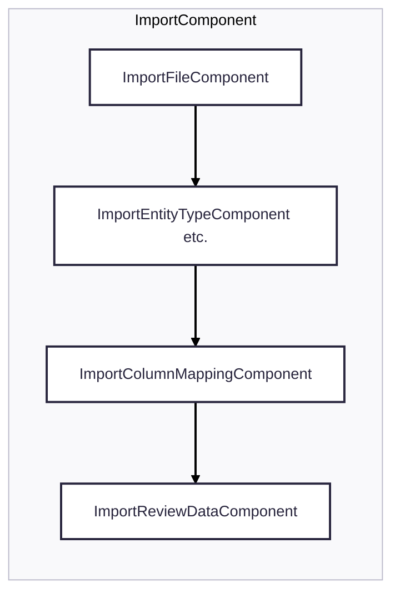
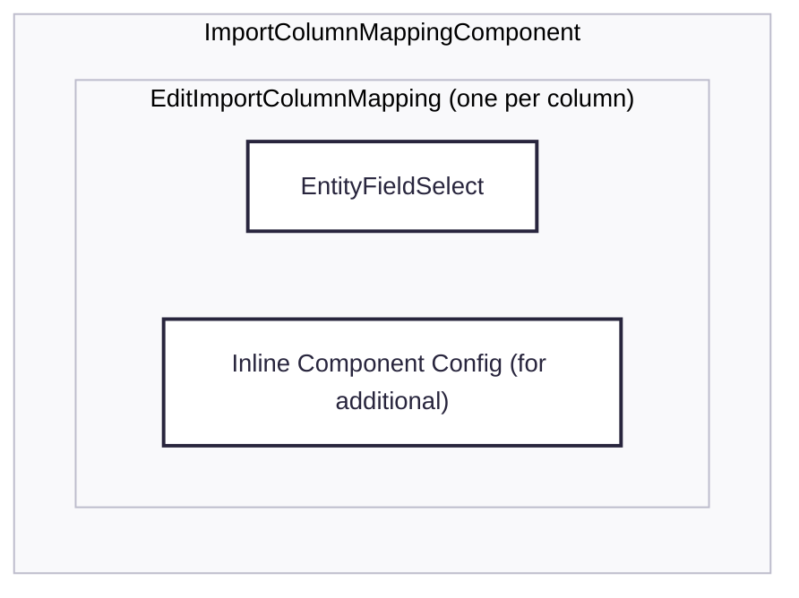

# Import Module

UI workflow to import data from a spreadsheet (.csv / .xlsx) into records of an entity type.

## Workflow

`ImportComponent` holds the state of the whole import in one `importSettings` signal and guides the
user through the steps of a stepper. Each step contributes one part of that state and is only
completed once its part is valid.

1. **ImportFileComponent** parses the file and produces the raw data together with the columns found
   in it.
2. **ImportEntityTypeComponent** (and the additional actions next to it) defines what the imported
   records become in the system.
3. **ImportColumnMappingComponent** maps each column of the file to a field of that entity type.
4. **ImportReviewDataComponent** previews the resulting records before `ImportService` writes them.

## Column mapping

`ImportColumnMappingComponent` renders one row per column of the file and pre-selects fields whose
name or label matches the column header (`ImportColumnMappingService`).

A row consists of the field select and, for fields that need more than a plain copy of the value, an
inline config component. Everything a single column needs is handled inside its own row component,
the parent only keeps the list of mappings.

### Transformation config (`additional`)

Datatypes declare how their values are configured for an import:

- `importConfigComponent`: the inline component shown next to the field select. Some are self
  contained (a checkbox for location lookups, a select for the property an entity reference is
  matched by), others only hold the button that opens a dialog.
- `importConfigDialog`: the dialog for datatypes whose configuration does not fit into the row, i.e.
  the value mapping of dropdowns and checkboxes, and the date format. `ImportConfigDialogService`
  opens it and hands back the resulting mapping.

Whatever the user confirms is stored in `ColumnMapping.additional` and used by the datatype's
`importMapFunction` when the records are built. `additional` is therefore also the marker of whether
a column has been configured: the dialogs only write it when the user confirms them, so a column that
requires a dialog and has no `additional` was either never opened or cancelled. Such a column shows
an error and blocks the step, so that the values of the file are never imported unchanged without the
user knowing (see `ImportConfigDialogService.isConfigMissing`).

## Re-using a previous import

Every executed import stores its settings as an `ImportMetadata` record, listed in
`ImportHistoryComponent`. Applying one of those copies its column mapping onto the columns of the
current file, matched by column name.
